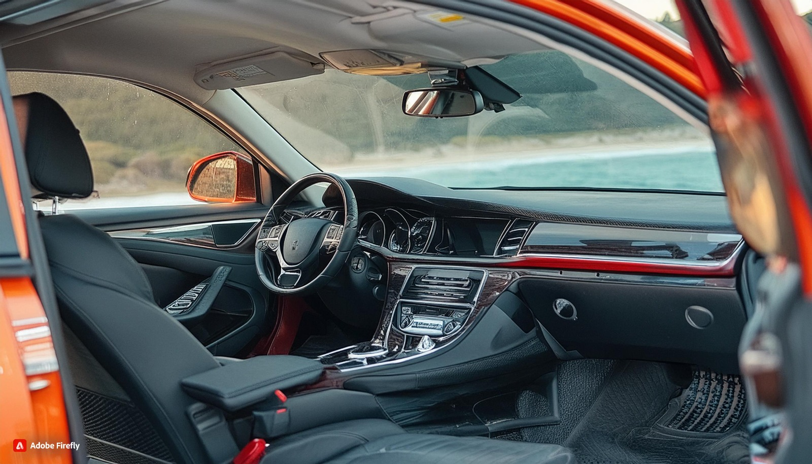
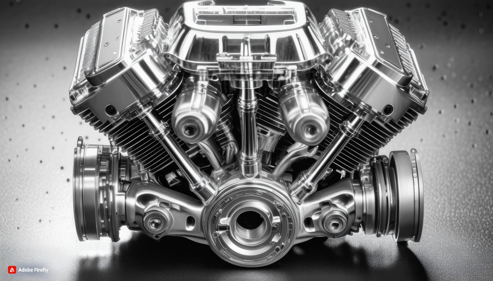

aqui va ir toda la info xd

primer pop up realizado con el codigo del siguiente repositorio:
https://github.com/albertorc87/window-notice.git

los carros fueron generado mediante la siguiente pagina

https://firefly.adobe.com/generate/images?id=de271ad6-69e4-420a-b631-c94db04de549

La barra de busqueda fue sacada del siguiente video  

https://youtu.be/6s4HFGD03EE?si=RsqjC391rnKXrleA

el pop up es lo siguiente
 poner en pagina1
    

            

                
Este sitio utiliza cookies para obtener la mejor experiencia en nuestra web. 
                <a href="terms.html">Leer más.</a>

                
<a href="#" id="close-button">Aceptar</a>

            

        

 ¡Bienvenidos a MQRG, tu destino para encontrar los autos de tus sueños! Somos una empresa fundada en España en el año 1992 por cuatro amigos apasionados: un talentoso dibujante, un entusiasta del mundo del motor,
        un visionario con una gran imaginación y un conductor experto. Desde nuestros días universitarios, cuando obtuvimos nuestros títulos, siempre tuvimos el sueño de crear una empresa que ofreciera a nuestros clientes 
        una experiencia excepcional y cómoda, combinada con la mejor asistencia y calidad de vehículos del mercado a precios accesibles.
         
        En MQRG, nos esforzamos por garantizar que cada cliente se sienta especial y bien atendido. Nuestro compromiso con la excelencia en el servicio al cliente es incomparable. Nos dedicamos a brindar una atención
        personalizada y profesional, desde el momento en que pones un pie en nuestras instalaciones hasta que sales conduciendo el automóvil de tus sueños.
         
        En MQRG, no solo vendemos autos, ¡sino que creamos experiencias inolvidables! Te invitamos a visitarnos y descubrir por qué somos la elección número uno para aquellos que buscan calidad, confianza y pasión por
        los automóviles. ¡Estamos aquí para hacer realidad tus sueños automovilísticos!
        <!--carousel de imagenes referenciado en el documento readme-->
        

            

                <input class="carousel-open" type="radio" id="carousel-1" name="carousel" aria-hidden="true" hidden="" checked="checked">
                

                    
                    
<h2 class="minititulo">Carroceria Potente</h2>
                        Este automóvil ofrece un interior que combina lujo, comodidad y tecnología para una experiencia de conducción excepcional. Al entrar, serás recibido por asientos de cuero suave, diseñados ergonómicamente para brindar un soporte óptimo durante largos viajes. La iluminación ambiental ajustable crea un ambiente acogedor y moderno, mientras que los detalles en acabado de madera o aluminio añaden un toque de elegancia.

                        El panel de instrumentos presenta una interfaz intuitiva y fácil de usar, con una pantalla táctil de alta resolución que te mantiene conectado y entretenido en todo momento. El sistema de sonido premium envolvente te sumerge en una experiencia auditiva de alta fidelidad, mientras que la conectividad Bluetooth te permite realizar llamadas manos libres y reproducir tu música favorita desde dispositivos móviles.
                        
                        El espacio interior es generoso, con amplio espacio para pasajeros y carga. Los controles de clima dual aseguran que tanto el conductor como los pasajeros puedan ajustar la temperatura a su preferencia individual. Además, los asientos traseros abatibles ofrecen flexibilidad adicional para transportar objetos grandes o equipos deportivos.
                        
                        Con su diseño meticuloso y atención al detalle, este automóvil brinda un interior que hace que cada viaje sea una experiencia placentera y lujosa. ¡Ven y descubre cómo este vehículo puede elevar tu experiencia de conducción a un nivel completamente nuevo!

                    

                

                <input class="carousel-open" type="radio" id="carousel-2" name="carousel" aria-hidden="true" hidden="">
                

                
                
<h2 class="minititulo">Comodidad en largos viajes </h2>

                

                <input class="carousel-open" type="radio" id="carousel-3" name="carousel" aria-hidden="true" hidden="">
                

                 
                
<h2 class="minititulo">Motores Potentes</h2>

                

                <label for="carousel-3" class="carousel-control prev control-1">‹</label>
                <label for="carousel-2" class="carousel-control next control-1">›</label>
                <label for="carousel-1" class="carousel-control prev control-2">‹</label>
                <label for="carousel-3" class="carousel-control next control-2">›</label>
                <label for="carousel-2" class="carousel-control prev control-3">‹</label>
                <label for="carousel-1" class="carousel-control next control-3">›</label>
                <ol class="carousel-indicators">
                    <li>
                        <label for="carousel-1" class="carousel-bullet">•</label>
                    </li>
                    <li>
                        <label for="carousel-2" class="carousel-bullet">•</label>
                    </li>
                    <li>
                        <label for="carousel-3" class="carousel-bullet">•</label>
                    </li>
                </ol>   
            
 
        

        

        <!--codigo relacionado al footer-->
        <footer>
            <a href="terms.html" class="f"><button class="Botons">Terminos y Condiciones</button></a> 
            <a href="AboutUs.html"><button class="Botons">
                About us
            </a>
            </button>
        </footer>
</body>
</html>

maes aqu en adelante tienen que poner todo tipo de links o cosas que uticen

linder
1-
2-
3-
4-
mc cook
1-
2-
3-
4-
Daniel 
1-
2-
3-
4-
papuallan rico sabroso hermoso junto a varon
1-
2-
3-
4-
5-
